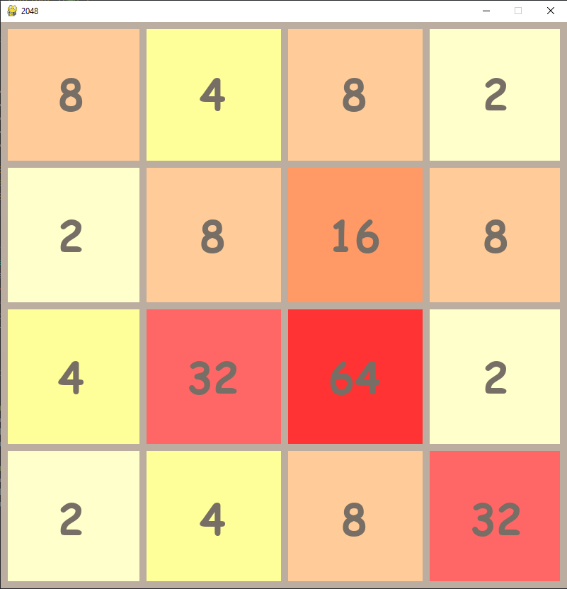

# 2048

A classic 2048 game implemented in Python using the Pygame library. The goal of the game is to combine tiles with the same value to create a tile with the value 2048.



## Table of Contents

- [Installation](#installation)
- [Usage](#usage)
- [Controls](#controls)
- [Contributing](#contributing)
- [License](#license)

## Installation

To run this game on your local machine, follow these steps:

1. **Clone the repository:**
    ```bash
    gh repo clone aFro95/2048-Game
    cd 2048-Game
    ```

2. **Install the dependencies:**
    Make sure you have Python and Pygame installed. You can install Pygame using pip:
    ```bash
    pip install pygame
    ```

## Usage

To start the game, simply run the script:
```bash
python 2048.py
```

## Controls
<ul><li>Left Arrow: Move tiles left</li>
<li>Right Arrow: Move tiles right</li>
<li>Up Arrow: Move tiles up</li>
<li>Down Arrow: Move tiles down</li></ul>

## Contributing
Contributions are welcome! If you'd like to contribute to this project, please follow these steps:

1. Fork this repository.
2. Create a branch:
```bash
git checkout -b feature/new-feature
```
3. Commit your changes:
```bash
git commit -m 'Add some feature'
```
4. Push to the branch:
```bash
git push origin feature/new-feature
```
5. Create a pull request.

## License
This project is licensed under the MIT License.
